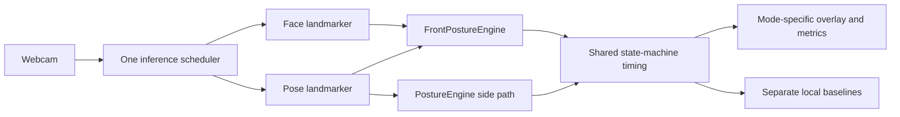

# NoTechNeck

NoTechNeck is a local posture monitor for desk work. A normal front-facing webcam, the one in the laptop lid or on the monitor, watches while you work. The app learns your usual position and reports when distance, head pose, or shoulder alignment stays off that baseline.

Side analysis is still there. It is the more specialized view: a camera beside you, measuring how the head sits relative to the shoulder and hip. It is not a medical upgrade over the front monitor. The two modes answer different geometric questions.

This is an ergonomic alignment tool. It does not diagnose pain, injury, or spinal health.

## What it does

- Opens one webcam on your machine and runs MediaPipe locally.
- **Front monitor** (default) uses the face landmarker and the pose landmarker together. It estimates distance from apparent face size, head pitch / yaw / roll, head advance relative to the shoulders, shoulder tilt, and a frontal slouch proxy.
- **Side analysis** keeps the existing ear → shoulder → hip pipeline: forward-head ratio, neck angle, torso angle, head-pitch proxy, ghost skeleton, and photo calibration.
- Asks you to hold your working position for five seconds. Each mode stores its own baseline.
- Ignores brief reaches, sips, and glances. Alerts only after a poor pattern is sustained.
- Keeps session totals in `localStorage`. It does not store video.

## Front and side

| | Front monitor | Side analysis |
| --- | --- | --- |
| Camera | Facing you, on the screen you are using | Beside you, in profile |
| Default | Yes, for a new install | Switch to it when you want the sagittal view |
| Signals | Face scale, shoulder scale, head pose, shoulder line | Ear, shoulder, hip |
| Baseline | `notechneck.frontBaseline.v1` | `notechneck.sideBaseline.v1` |
| What it cannot see | True side-view neck angle | How far you are from the screen in centimeters |

Switching modes stops the previous inference loop, clears transient tracking, and loads that mode's calibration. A side baseline is never reused as a front baseline.

## How front monitoring works

1. Sit as you normally work. Face and both shoulders need to be in frame. Hips are not required. Look at the screen, not into the lens. That slightly downward gaze is the posture being calibrated.
2. Hold still for five seconds. Blinks, large head turns, lost shoulders, and outlier frames are dropped. The baseline is a median.
3. After that, the app compares the live frame with your baseline.

Distance uses apparent size, not MediaPipe's Z value.

```
faceScale = median(eye-corner span, cheek span, face-width span)
relativeDistance = baselineFaceScale / currentFaceScale
```

`1.0` is the calibrated distance. `0.8` is about 20% closer. `1.2` is about 20% farther. Those spans are pixel distances divided by the shorter side of the video, so the ratio does not depend on the frame's pixel size.

If you optionally measure the distance from your eyes to the screen once, later scale changes convert to centimeters:

```
estimatedCm = knownBaselineCm × baselineFaceScale / currentFaceScale
```

Without that measurement the UI says "12% closer" or "At baseline". It does not invent centimeters.

Head advance separates a head moving toward the screen from the whole chair moving closer:

```
headAdvanceRatio = (currentFaceScale / baselineFaceScale) / (currentShoulderScale / baselineShoulderScale)
```

If the face and shoulders grow together, the ratio stays near 1 and the change is treated as distance. If the face grows and the shoulders stay put, the ratio rises and, after it persists, the state can become head forward.

Head pitch, yaw, and roll come from the facial transformation matrix (X to the subject's right, Y up, Z toward the camera; positive pitch looks down). Classification uses the change from your baseline, so a normal laptop gaze is not "looking down."

A frontal slouch is only named when several cues agree: the chin-to-shoulder gap shrinks, the head center drops, and pitch moves downward. One raised shoulder is asymmetry, not collapse.

## How side analysis works

Place the camera to your side until the head, shoulder, and hip of one side are visible. The five-second hold, photo import, and upright image prior are unchanged. Features are still torso-normalized: forward-head ratio, neck angle, torso angle, and the image-space pitch proxy. The ghost stays anchored to the current hip.

## Limits

- Front view cannot directly measure the side-view craniovertebral or neck angle. Head advance is a scale proxy, not that angle.
- Screen distance is relative unless you enter one measured baseline distance. The result is an estimate from apparent size, not a clinical measurement.
- If the camera is not mounted on the screen you are working on, the distance is camera distance. The app will not call it screen distance.
- A brief look at another monitor is not scored as poor posture. Large yaw makes the frame unscored.
- Moving the whole body toward the camera changes distance. It is not, by itself, forward-head posture.
- One bad frame does not change state or alert. Poor posture has to persist, and an alert waits longer than that.
- Calibrating in a slouch makes that slouch the reference.
- One person is tracked. Occlusion and fast motion drop tracking. Those gaps are not counted as poor posture.

## Privacy

- Camera frames are processed in the page. They are not uploaded.
- Raw video is not written to disk or `localStorage`.
- The pose model, the face model, and the WASM runtime are downloaded once into `public/` by `npm run fetch-assets`, then loaded from your own dev server or build. That download is the model, not your camera.
- Saved data is the two baselines, settings, session totals, and optional developer feature rows. An older `notechneck.baseline.v1` is migrated into the side baseline and is not reinterpreted as front calibration.

## Architecture



| Area | Location |
| --- | --- |
| Front and side engines | `src/engine/frontPostureEngine.ts`, `src/engine/postureEngine.ts` |
| Face and pose runtimes | `src/cv/faceDetector.ts`, `src/cv/poseDetector.ts` |
| Scheduled dual inference | `src/hooks/useFrontDetection.ts` |
| Front geometry, rules, calibration | `src/cv/faceGeometry.ts`, `src/posture/front*.ts` |
| Side geometry and rules | `src/posture/` |
| Thresholds | `src/config/frontPostureConfig.ts`, `src/config/postureConfig.ts` |
| Storage | `src/analytics/storage.ts` |

Face inference targets about 12 fps and pose about 10 fps. The video element still renders at the display rate. If a model call is in progress, the next frame for that tick is skipped. GPU is preferred when WebGL exists, with a CPU fallback. React state is not updated on every inference frame.

## Running locally

```bash
npm install
npm run dev
```

`npm run dev` and `npm run build` fetch the WASM runtime plus the pose and face models into `public/` if they are not already there.

```bash
npm test
npm run typecheck
npm run lint
npm run build
```

Open the dev server and allow the camera. Front monitor is the first screen. Side analysis is the other segment in the header.

## Debug mode

Add `?debug=true` or enable **Developer readout** in settings.

Front debug shows face and pose latency, both frame rates, scales, distance ratio, head advance, yaw, pitch, roll, lateral offset, shoulder tilt, chin gap, and the collapse index. The dense face mesh is drawn only in this mode. Recording exports rows tagged `mode: front` with labels such as `upright`, `too_close`, `head_forward`, `collapsed`, `side_lean`, `shoulder_asymmetry`, `temporary_reach`, `looking_away`, and `other`.

Side recording still uses `upright`, `forward_head`, `slouch`, `looking_down`, `temporary_reach`, and `other`.

## Browser requirements

A current desktop browser with `getUserMedia` and either WebGL or WASM. Chrome and Edge are the most predictable. The layout is aimed at a laptop-width window and collapses to a single column below that.
