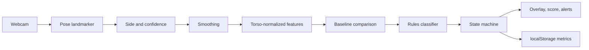

# NoTechNeck

NoTechNeck is a local, real-time posture monitor for desk work. A webcam sits at roughly a side angle. The app estimates upper-body pose in the browser, learns your upright baseline, and reports when forward-head posture, torso slouch, or a downward gaze stays off that baseline.

It is an ergonomic alignment tool. It is not a medical device, and it does not diagnose pain, injury, or spinal health.

## What it does

- Opens a webcam feed on your machine and runs pose estimation locally.
- Asks you to sit upright and hold still for five seconds to capture a personal baseline.
- Tracks head, neck, shoulder, and torso deviation from that baseline.
- Shows a live skeleton and a ghost of the calibrated posture, anchored to your current hip.
- Waits through brief movements before changing state, and alerts only after poor posture is sustained.
- Keeps session totals: good time, poor time, longest episode, and average posture score.
- Stores the baseline, settings, and derived session stats in `localStorage`. It does not store video.

## Architecture



The same path in source order:

| Area | Location |
| --- | --- |
| Camera and pose runtime | `src/hooks/useCamera.ts`, `src/hooks/usePoseDetection.ts`, `src/cv/poseDetector.ts` |
| Landmarks, smoothing, normalization | `src/cv/` |
| Geometry, calibration, classifier, state machine | `src/posture/` |
| Tunable constants | `src/config/postureConfig.ts` |
| Frame pipeline | `src/engine/postureEngine.ts` |
| Sessions and dataset export | `src/analytics/` |
| Interface | `src/components/`, `src/App.tsx` |

The browser app does not use Python. A future learned classifier can train offline on exported feature rows.

## Computer vision pipeline

1. `getUserMedia` starts one video track. Inference does not start until the video element has dimensions.
2. MediaPipe Pose Landmarker runs in video mode, throttled to about 15 fps. The video element itself renders at the browser’s normal rate. Overlapping inference calls are skipped.
3. The pipeline reads nose, eyes, ears, shoulders, elbows, wrists, and hips. World landmarks are kept on the frame for experiments and are not used for classification.
4. The more visible side (ear, shoulder, hip) is selected. Switching sides requires a confidence lead across several frames.
5. Facing direction comes from the nose relative to the shoulder, with the same kind of hysteresis. “Forward” is then positive toward the face on either side.
6. Landmark coordinates pass through an exponential moving average (or an optional One Euro filter) before any angle is computed.
7. Distances are divided by shoulder-to-hip length. Frames with a tiny torso length are rejected.
8. Each accepted frame produces:
   - **Forward-head ratio** — horizontal ear shift in front of the shoulder, in torso lengths
   - **Neck angle** — shoulder-to-ear inclination from vertical, in degrees
   - **Torso angle** — shoulder-to-hip inclination from vertical, in degrees
   - **Head pitch** — an image-space proxy from ear to nose; positive means the nose sits lower than the forward axis
   - **Shoulder–hip ratio** — vertical torso span over torso length

GPU is preferred when WebGL is available. If it fails, the landmarker retries on CPU.

## How calibration works

Calibration is required. The app does not grade you against a universal anatomical angle.

1. Sit in the upright posture you want as your reference.
2. Place the camera to your side until head, shoulder, and hip are visible and one side is clearly closer to the camera.
3. Hold still for five seconds. Low-confidence frames are dropped. The baseline stores the median of each feature and the median absolute deviation, plus a hip-relative skeleton for the ghost.

The ghost is redrawn on your current hip and scaled by the current torso length, so it compares posture rather than where you sat in the frame during calibration. A large change in apparent body size, or a flip to the other side, asks you to recalibrate. Recalibration is available at any time. The baseline stays in `localStorage` until you clear it.

A hold that is already slumped would make that slump the definition of upright. After calibration, each feature is compared with an upright prior measured from side-view reference photos (`src/posture/referencePoses.ts`). The prior only keeps photos whose measured head is still stacked over the shoulders. If your hold is worse than that prior by at least the poor-posture gap, the baseline angles move to the prior and the ghost is replaced with that reference skeleton. Your torso length, camera side, and facing stay as captured. You can also skip the live hold and choose side-view photos of yourself sitting upright. Those pictures are read locally and are not stored.

## How posture classification works

Classification uses **change from your baseline**, not absolute angles.

A transparent rules classifier labels each reliable frame as upright, mild drift, forward head, torso slouch, looking down, or both head and torso. Forward head requires a forward shift together with a neck-angle change, so leaning your whole body toward the desk is torso slouch rather than forward head. Looking down requires the pitch proxy to change while the head has not also translated forward. Thresholds live in `POSTURE_CONFIG`. Leaving a pattern uses a lower exit threshold so the label does not flicker.

The state machine then requires time:

| From the start of a deviation | What you see |
| --- | --- |
| Under 2 seconds | No change. Reaches and glances stay upright. |
| 2–5 seconds of a mild or poor pattern | Drifting |
| After 5 seconds of a poor pattern | The specific posture |
| 20 seconds by default | One alert, then a cooldown |

Returning to upright waits through a short recovery hold. Time spent with a lost or degraded camera signal is not counted as poor posture, and a hidden tab does not advance the deviation clock. The posture score starts at 100 at your baseline and falls as forward head, neck, torso, and gaze deviations grow. It is an ergonomic alignment score, not a health score.

Alerts are an in-app notice by default. Sound and browser notifications are off until you turn them on. Notification permission is requested only from that toggle.

## Privacy model

- Camera frames are processed in the page. They are not uploaded.
- Raw video is not written to disk or `localStorage`.
- The pose model and its WASM runtime are downloaded once into `public/` and then loaded from your own dev server or build. That download is the model, not your camera.
- Saved data is the baseline, settings, session totals, and optional developer feature rows.

## Running locally

```bash
npm install
npm run dev
```

`npm install` does not download the pose model. `npm run dev` and `npm run build` run `npm run fetch-assets` first, which copies MediaPipe WASM out of `node_modules` and downloads the full float16 pose landmarker if it is not already in `public/models/`.

Other commands:

```bash
npm test
npm run typecheck
npm run lint
npm run build
npm run preview
```

Open the dev server, allow the camera, sit sideways to it, and calibrate.

## Browser requirements

A current desktop browser with `getUserMedia` and either WebGL or WASM. Chrome and Edge are the most predictable. Firefox and Safari work when they can open the camera and run the landmarker. The layout is aimed at a laptop-width window and collapses to a single column below that.

## Debug mode

Add `?debug=true` or enable **Developer readout** in settings. The overlay then draws the raw joints and a forward tick, and the side panel shows confidence, side, facing, feature values, deltas, inference time, and state duration.

Developer mode can also record derived feature rows with labels (`upright`, `forward_head`, `slouch`, `looking_down`, `temporary_reach`, `other`) and export CSV or JSON. Landmark coordinates are included only if you opt in. Video is never recorded.

## Known limitations

- Angles are 2D image-space proxies. They are not clinical joint measurements, and there is no camera calibration in centimeters.
- The baseline is only as good as the posture you hold while capturing it. Calibrating in a slouch makes that slouch the reference.
- A frontal webcam will not pass the side-profile check. The model needs the head, shoulder, and hip of one side.
- Head pitch disappears when the nose is not visible.
- Elbows and wrists are drawn only as optional context. They are not part of the score.
- One person is tracked. Very fast motion, occlusion, and unusual clothing can drop tracking; those gaps are not scored as poor posture.
- Torso-length change is only a hint that the camera moved. It is not a measured distance.
- The rules and timings are a starting point. They should be tuned with recorded feature rows from real sessions.

## Future ML classifier

The rules classifier is the v1 decision layer. `docs/future-temporal-model.md` describes a later model that would train on exported feature sequences and could replace or sit beside these rules. Workstation cues (screen height, viewing angle) are documented there as a separate extension and are not part of this version.
